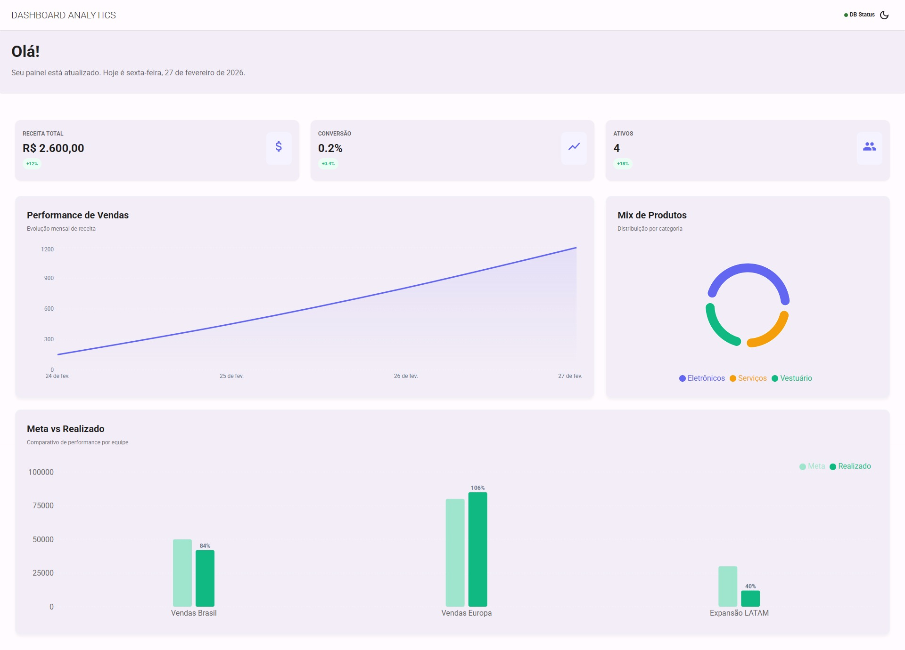
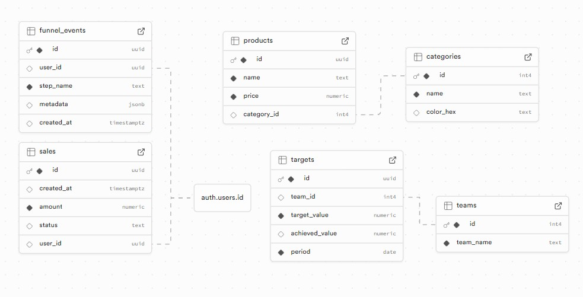

# 📊 Operational Performance Dashboard

A real-time data analysis dashboard developed with **React** and **Supabase**, focused on visualizing team goals versus results.

## 🖼️ Project Visualization

### Main Dashboard



### Data Model (Relationship)



## 🚀 Technologies Used

- **React.js**: Main library for the user interface.

- **Recharts**: Library of customizable charts for data visualization.

- **Supabase**: Backend-as-a-Service (BaaS) for PostgreSQL database and authentication.

- **Lucide React**: Package of modern and lightweight icons.

- **Tailwind CSS**: Responsive styling and design system.

## 💡 Main Features

- **Dynamic Charts**: Visualization of sales performance and goal achievement.

- **Real-time Integration**: Consumption of data directly from Supabase via relational queries.

- **Refined UI/UX**: Use of a strategic color palette (Slate for goals and Success for results) for better readability.

- **Security**: Implementation based on Supabase's Row Level Security (RLS).

## 🛠️ How to run the project locally

1. Clone the repository:

```bash

git clone [https://github.com/rafaeldevgmail/workspace.git](https://github.com/rafaeldevgmail/workspace.git)
```
