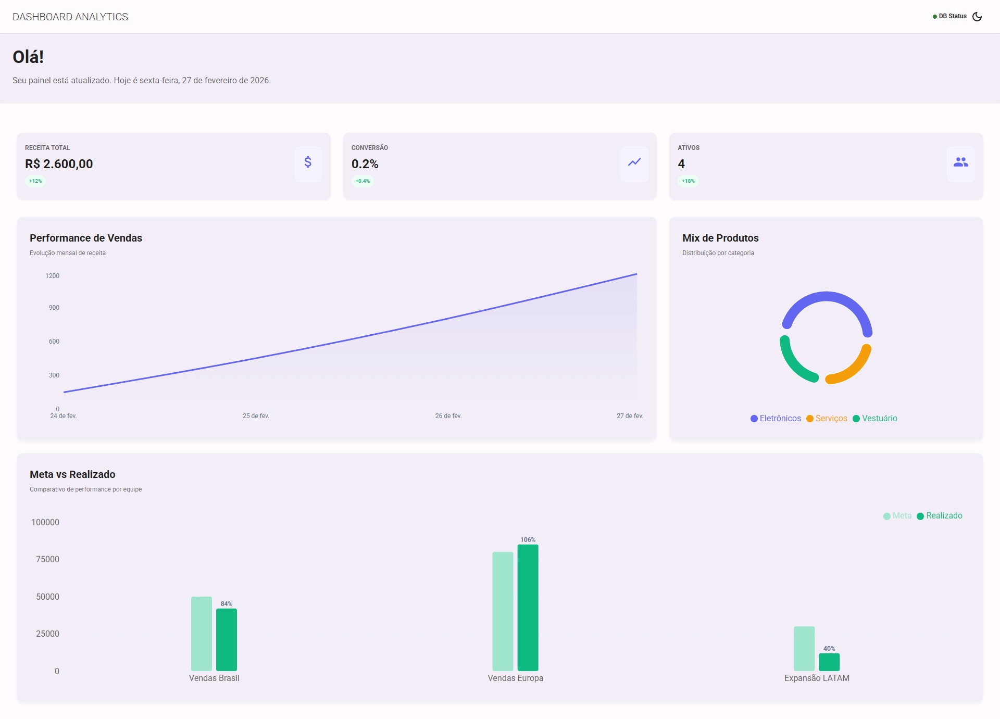
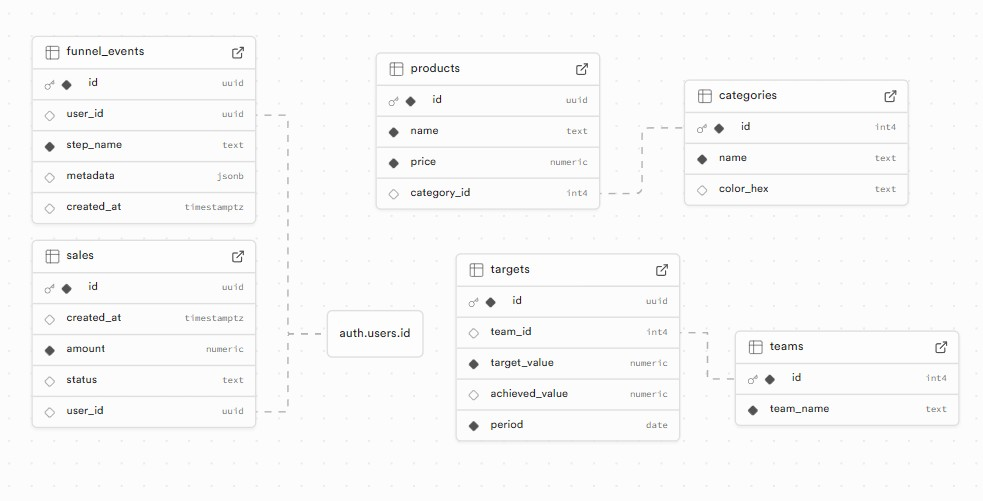

# 📊 Dashboard de Performance Operacional

Um painel de análise de dados em tempo real desenvolvido com **React** e **Supabase**, focado em visualização de metas vs. resultados de equipes.


## 🖼️ Visualização do Projeto

### Dashboard Principal



### Modelo de Dados (Relacionamento)



## 🚀 Tecnologias Utilizadas

- **React.js**: Biblioteca principal para a interface do usuário.
- **Recharts**: Biblioteca de gráficos customizáveis para visualização de dados.
- **Supabase**: Backend-as-a-Service (BaaS) para banco de dados PostgreSQL e autenticação.
- **Lucide React**: Pacote de ícones modernos e leves.
- **Tailwind CSS**: Estilização responsiva e design system.

## 💡 Funcionalidades Principais

- **Gráficos Dinâmicos**: Visualização de performance de vendas e atingimento de metas.
- **Integração Real-time**: Consumo de dados diretamente do Supabase via queries relacionais.
- **UI/UX Refinada**: Uso de paleta de cores estratégica (Slate para metas e Success para resultados) para melhor legibilidade.
- **Segurança**: Implementação baseada em Row Level Security (RLS) do Supabase.

## 🛠️ Como rodar o projeto localmente

1. Clone o repositório:
   ```bash
   git clone [https://github.com/rafaeldevgmail/workspace.git](https://github.com/rafaeldevgmail/workspace.git)
   ```
